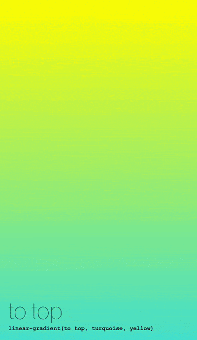
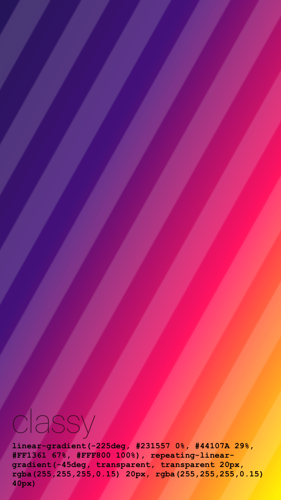
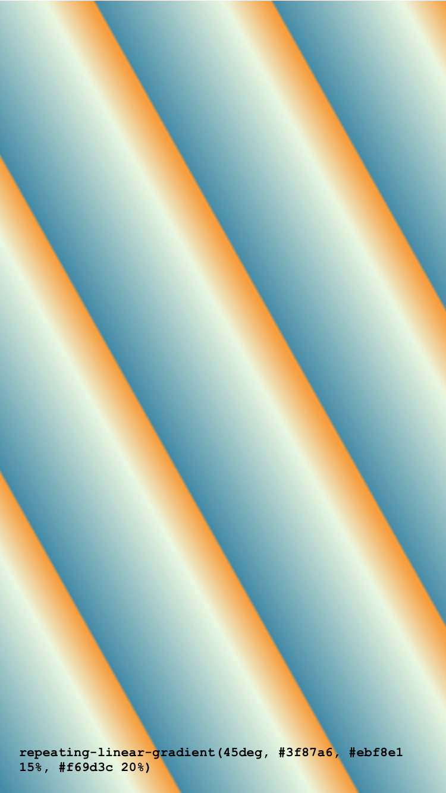
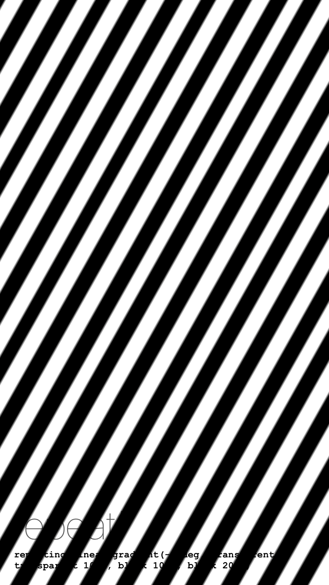
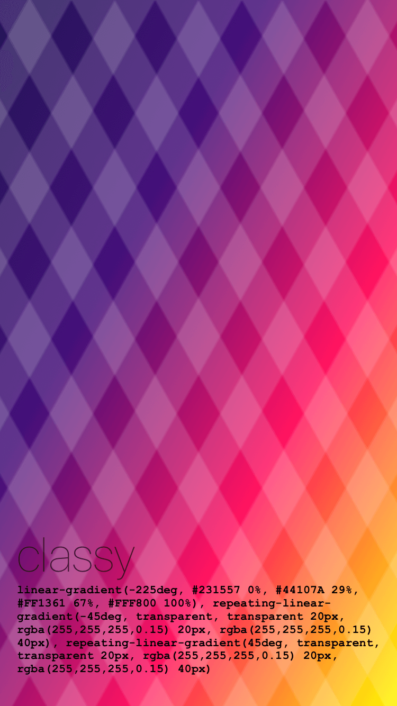
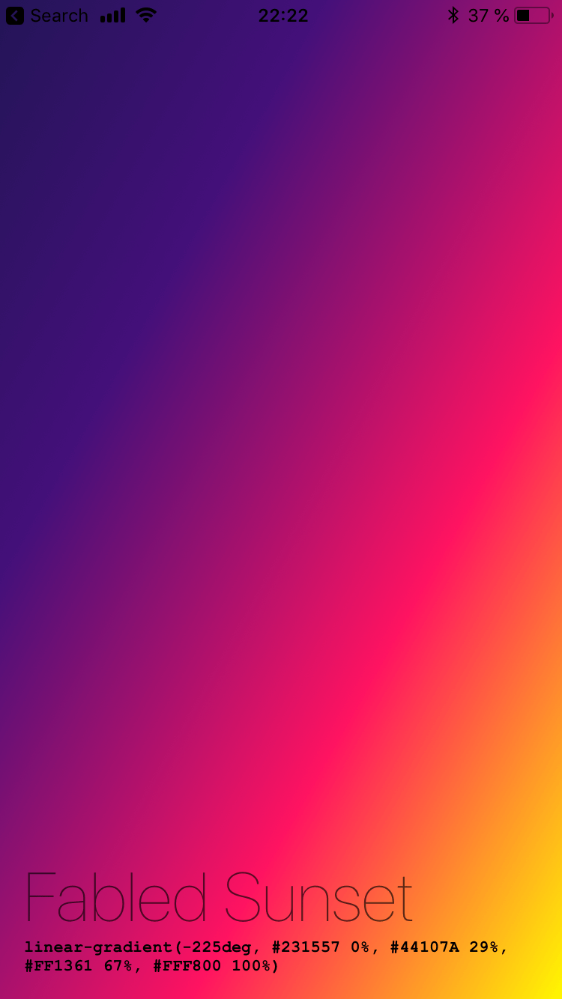

# CSS Gradient for LinearGradient

CSS background image for React-Native.
Supported backgrounds:
- [linear-gradient](https://developer.mozilla.org/en-US/docs/Web/CSS/linear-gradient)
- [repeating-linear-gradient](https://developer.mozilla.org/en-US/docs/Web/CSS/repeating-linear-gradient)



<br/>

<br/>

<br/>

<br/>

<br/>

<br/>



### Usage

```
import Gradient from 'react-native-css-gradient`;

render() {
    const gradient = `linear-gradient(-225deg, #231557 0%, #44107A 29%, #FF1361 67%, #FFF800 100%), repeating-linear-gradient(-115deg, transparent, transparent 20px, rgba(255,255,255,0.1) 20px, rgba(255,255,255,0.1) 40px), repeating-linear-gradient(115deg, transparent, transparent 20px, rgba(255,255,255,0.1) 20px, rgba(255,255,255,0.1) 40px)`;

    return <Gradient gradient={gradient} style={yourStyle}>
}
```

This library will first try to import `LinearGradient` from [Expo](https://expo.io) or fallback to [react-native-linear-gradient](https://github.com/react-native-community/react-native-linear-gradient).

### Props

|Prop|Details|
|---|---|
|gradient|CSS Gradient (linear and repeating) are working for the moment|
|style|default styles (**Note, if you're going to use repeating gradient you have to specify the width and height**)|
|children|-|


### About

If you have questions please don't hesistate to contact me on [Twitter](http://twitter.com/mironcatalin).